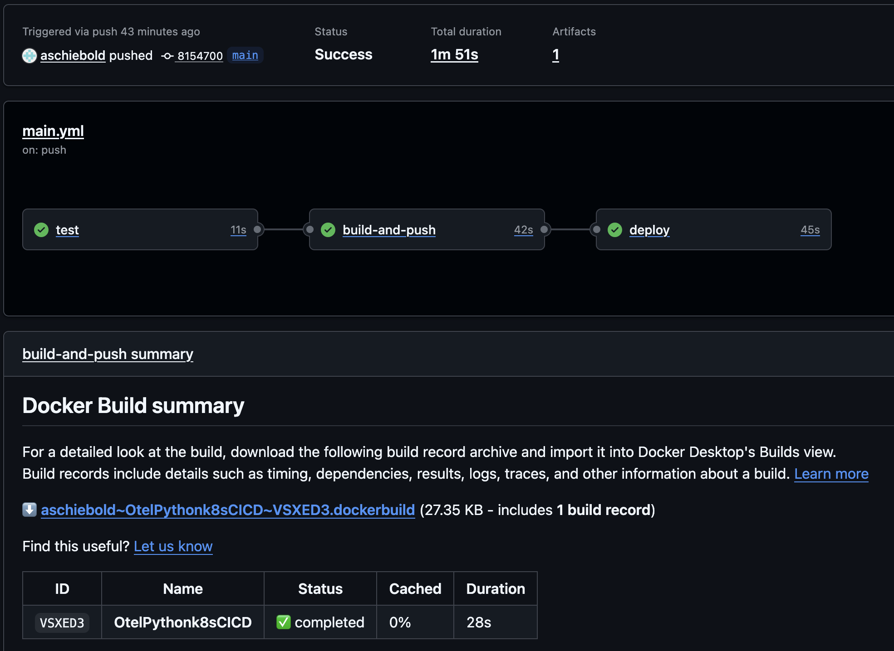
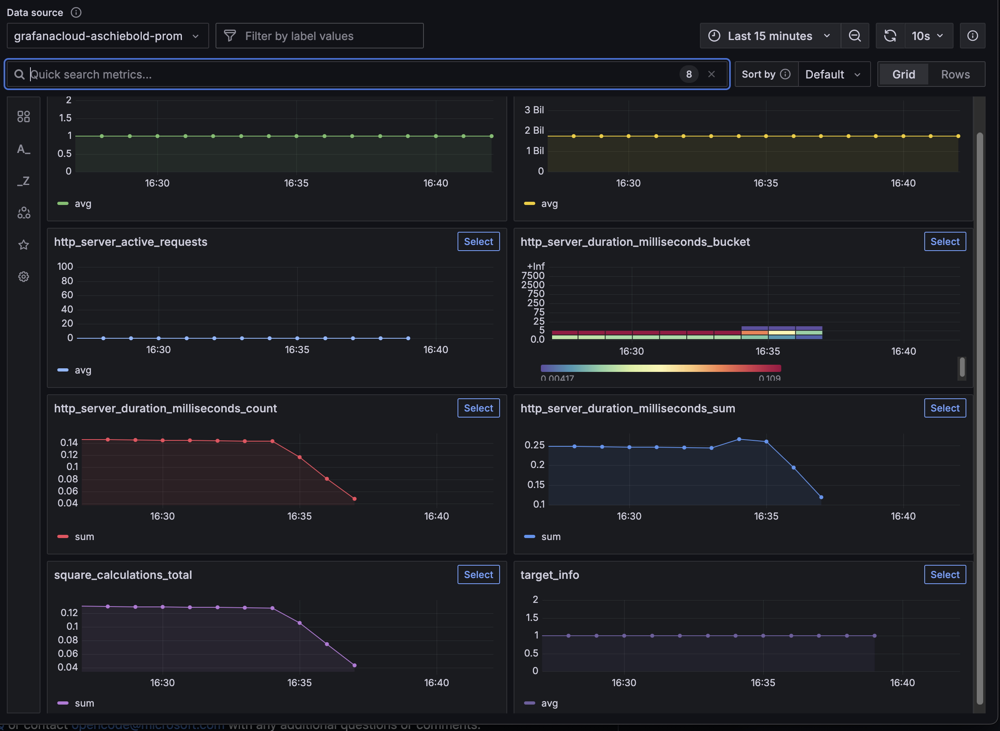

# Open telemetry on Python in k8s with Github CI/CD unit test and deployment test

docker build -t yourusername/square-app:latest .
docker push yourusername/square-app:latest

Replace yourusername with your Docker Hub username.

Add DOCKER_USERNAME and DOCKER_PASSWORD in your GitHub repository’s Settings > Secrets and variables > Actions.

kubectl apply -f kubernetes/deployment.yaml -f kubernetes/service.yaml -f /PATH/TO/Grafana/Secret.yaml

Test the app:
curl -X POST http://localhost:8080/square -H "Content-Type: application/json" -d '{"number": 5}'

CICD:

View metrics in Grafana:

